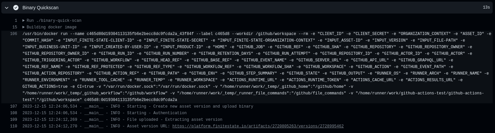

# [Finite State](https://finitestate.io) `binary-scan` Action


[finitestate.io](https://finitestate.io)

<!-- action-docs-description -->

## Description

The Finite State `binary-scan` GitHub Action allows you to easily integrate the
Finite State Platform into your CI/CD workflows.

Following the steps below will:

- Upload the file to the Finite State platform
- Create a new version of the configured asset
- Conduct a Quick Scan binary analysis on the uploaded file
- Associate the results to the asset version

By default, the asset version will be assigned the existing values for Business
Unit and Created By User. If you need to change these, you can provide the IDs
for them.

> [!WARNING]  
> Warning: Ensure the GitHub Actions runner environment supports both Node.js and Python when running workflows that include JavaScript and Python scripts. Using an incompatible runner environment may result in errors or unexpected behavior during script execution.
>
> To avoid issues, consider using a GitHub-hosted runner image like 'ubuntu-latest' or 'microsoft-latest' that comes pre-installed with both Node.js and Python.

<!-- action-docs-description -->

<!-- action-docs-inputs -->

## Inputs

| parameter                         | description                                                                                                                                                                                  | required | type      | default |
| --------------------------------- | -------------------------------------------------------------------------------------------------------------------------------------------------------------------------------------------- | -------- | --------- | ------- |
| finite-state-client-id            | Finite State API client ID                                                                                                                                                                   | `true`   | `string`  |         |
| finite-state-secret               | Finite State API secret                                                                                                                                                                      | `true`   | `string`  |         |
| finite-state-organization-context | The Organization-Context should have been provided to you by your Finite State representative and looks like `xxxxxxx-xxxx-xxxx-xxxx-xxxxxxxxxxxx`                                           | `true`   | `string`  |         |
| asset-id                          | Asset ID for the asset that the new asset version will belong to                                                                                                                             | `true`   | `string`  |         |
| version                           | The name of the asset version that will be created                                                                                                                                           | `true`   | `string`  |         |
| file-path                         | Local path of the file to be uploaded                                                                                                                                                        | `true`   | `string`  |         |
| quick-scan                        | Boolean that uploads the file for quick scan when true. Defaults to true (Quick Scan). For details about the contents of the Quick Scan vs. the Full Scan, please see the API documentation. | `false`  | `boolean` | `true`  |
| automatic-comment                 | Defaults to false. If it is true, it will generate a comment in the PR with the link to the Asset version URL in the Finite State Platform.                                                  | `false`  | `boolean` | `false` |
| github-token                      | Token used to generate a comment in a the PR. Only required if automatic-comment input is true.                                                                                              | `false`  | `string`  |         |
| business-unit-id                  | (optional) ID of the business unit that the asset version will belong to. If not provided, the asset version will adopt the existing business unit of the asset.                             | `false`  | `string`  |         |
| created-by-user-id                | (optional) ID of the user to be recorded as the 'Created By User' on the asset version. If not provided, the version will adopt the existing value of the asset.                             | `false`  | `string`  |         |
| product-id                        | (optional) ID of the product that the asset version will belong to. If not provided, the existing product for the asset will be used, if applicable.                                         | `false`  | `string`  |         |
| artifact-description              | (optional) Description of the artifact. If not provided, the default is "Firmware Binary".                                                                                                   | `false`  | `string`  |         |

<!-- action-docs-inputs -->

<!-- action-docs-outputs -->

## Outputs

| parameter         | description                                                     |
| ----------------- | --------------------------------------------------------------- |
| response          | Response from Finite State servers                              |
| error             | Error message or details on why the action fails, if applicable |
| asset-version-url | URL to view your results in the Finite State Platform           |

<!-- action-docs-outputs -->

## Set Up Workflow

To start using this action, you must generate a job within a GitHub Workflow.
You can either establish a
[new GitHub Workflow](https://docs.github.com/en/actions/learn-github-actions/workflow-syntax-for-github-actions)
or use an existing one that aligns with your use case.

After selecting a GitHub Workflow, proceed to
[customize the events](https://docs.github.com/en/actions/learn-github-actions/events-that-trigger-workflows)
that will activate the workflow, such as pull requests or scheduled events:

**Example**:

```yaml
name: Your workflow
on:
  pull_request:
    branches:
      - main
  schedule:
    - cron: '0 0 * * *'
```

If you want the PR to automatically generate a comment with the link to the
results on the Finite State Platform, make sure to grant the necessary
permissions in your workflow. This allows the action to post the comment using
the GitHub workflow token.

**Example**:

```yaml
name: Your workflow
permissions:
  pull-requests: write
  contents: read
```

## Usage of this Action

You will also need to add your code into the workflow. The example only includes
the required parameters. For more details, including optional parameters, please
reference the **Inputs** section.

**Example:**

```yaml
uses: FiniteStateInc/binary-scan@v2.0.0
with:
  finite-state-client-id: ${{ secrets.CLIENT_ID }}
  finite-state-secret: ${{ secrets.CLIENT_SECRET }}
  finite-state-organization-context: ${{ secrets.ORGANIZATION_CONTEXT }}
  asset-id: # The ID of the Asset associated with this scan
  version: # The name of the new Asset Version that will be created
  file-path: # The path to the file that will be uploaded to the Finite State Platform
```

Using the previous code you won't get any comments in the pull request, but file
will be upload to Finite State Platform and you get the link as output of the
action.

### Auto-Generation of PR Comments

The following example includes optional parameters `github-token` and
`automatic-comment` to auto-generate a comment in a pull request:

**Example:**

```yaml
uses: FiniteStateInc/binary-scan@v1.1.0
with:
  finite-state-client-id: ${{ secrets.CLIENT_ID }}
  finite-state-secret: ${{ secrets.CLIENT_SECRET }}
  finite-state-organization-context: ${{ secrets.ORGANIZATION_CONTEXT }}
  asset-id: # The ID of the Asset associated with this scan
  version: # The name of the new Asset Version that will be created
  file-path: # The path to the file that will be uploaded to the Finite State Platform
  github-token: ${{ secrets.GITHUB_TOKEN }} # Optional if you would like to generate the comment automatically in the PR
  automatic-comment: true # Optional if you would like to generate the comment automatically in the PR
```

## Action Debugging

All details pertaining to the execution of the action will be recorded. You can
review this information in the workflow execution logs, which is a helpful
starting point if you encounter any errors during the action's run.



## Extended Feature Example (Optional)

In this section, we provide a code snippet for integrating this action into your
existing workflow. Primarily, it uploads the file to the Finite State Platform
for analysis. Once that process is complete, it automatically add a comment to
the pull request, including a link pointing to the Finite State Binary Analysis
URL for the uploaded file. You can customize the comment as desired or utilize
the outputs of the action to construct your own.

Ensure to replace certain values, as indicated in the example workflow:

```yaml
name: Build
permissions:
  pull-requests: write
  contents: read
on:
  pull_request:
    branches:
      - main
  schedule:
    - cron: '0 0 * * *' # At 00:00 every day

env:
  CLIENT_ID: ${{ secrets.CLIENT_ID }}
  CLIENT_SECRET: ${{ secrets.CLIENT_SECRET }}
  ORGANIZATION_CONTEXT: ${{ secrets.ORGANIZATION_CONTEXT }}
  ASSET_ID: # Complete with your Asset ID

jobs:
  finitestate-upload-binary:
    runs-on: ubuntu-latest
    steps:
      - name: checkout repo content
        uses: actions/checkout@v3
        with:
          ref: ${{ github.event.pull_request.head.ref }}

      # - name: (Potentially) Build a system / firmware image
      # Uncomment previous line and Put the build steps here (which likely already exist) based on the project

      - name: Upload binary generated file
        uses: actions/upload-artifact@v3
        with:
          name: binary-artifact
          path: # Put the path to your binary file generated in the previous step here

      - name: Binary Scan
        uses: FiniteStateInc/binary-scan@v2.0.0
        id: binary_scan
        with:
          finite-state-client-id: ${{ secrets.CLIENT_ID }}
          finite-state-secret: ${{ secrets.CLIENT_SECRET }}
          finite-state-organization-context: ${{ secrets.ORGANIZATION_CONTEXT }}
          asset-id: ${{env.ASSET_ID}}
          version: ${{github.sha}} # You can name this version anything you'd like. Here, we're using the git commit hash associated with the current run.
          file-path: # Put the same path from the "Upload binary generated file" step here
          github-token: ${{ secrets.GITHUB_TOKEN }} # optional if you would like to generate the comment automatically in the PR
          automatic-comment: true # optional if you would like to generate the comment automatically in the PR
      - name: Set response of binary scan
        if: steps.binary_scan.outcome=='success'
        id: set_response
        run: |
          echo Asset version URL: ${{steps.binary_scan.outputs.asset-version-url}}
          echo Response: "${{steps.binary_scan.outputs.response}}"
          echo Error: "${{steps.binary_scan.outputs.error}}"
    outputs:
      ASSET_VERSION_URL: ${{steps.binary_scan.outputs.asset-version-url}}
      ERROR: ${{steps.binary_scan.outputs.error}}
      RESPONSE: ${{steps.binary_scan.outputs.response}}
```
